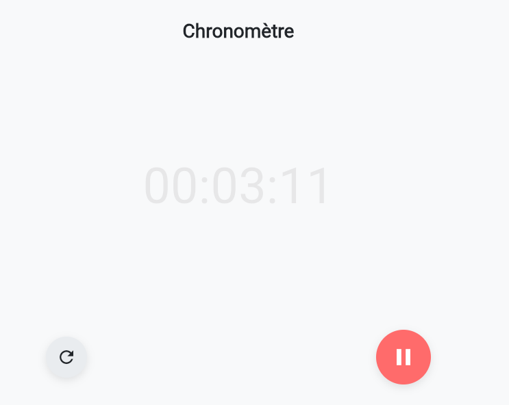

# stopwatch

## Description
Application mobile de chronomètre permettant de mesurer le temps avec précision.  
L’utilisateur peut démarrer, mettre en pause et réinitialiser le chronomètre via une interface simple et fluide.  
Ce projet est le **septième** du défi personnel **100 projets en 2026**.

---

## Objectifs du projet
- Manipuler les timers et le temps réel en Flutter
- Mettre à jour l’interface dynamiquement
- Gérer l’état de l’application
- Concevoir une interface mobile ergonomique

---

## Plateforme
- Mobile

---

## Technologies utilisées
- Flutter
- Dart

---

## Fonctionnalités
- Démarrage du chronomètre
- Pause / Reprise
- Réinitialisation
- Affichage précis du temps (minutes, secondes, millisecondes)
- Interface fluide et responsive

---

## Design & UX
- Grand affichage central du temps
- Boutons larges et accessibles
- Design moderne et minimal
- Bonne lisibilité

---

## 📸 Captures d’écran

---

## Ce que j’ai appris
- Utilisation des classes `Timer` et `Stopwatch`
- Gestion de l’état en Flutter
- Rafraîchissement UI en temps réel
- Organisation d’un projet Flutter

---

## Améliorations possibles
- Enregistrement des temps
- Tours (laps)
- Mode sombre
- Vibrations au démarrage/arrêt

---

## Statut du projet
 **Projet terminé**
